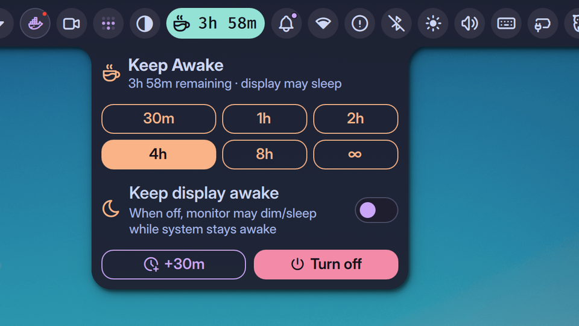

# Keep Awake+

A richer replacement for Noctalia's built-in `KeepAwake` widget. Pick a
duration, pick a scope, extend on the fly.

## Features

- **Two scopes**
  - `partial` — system stays awake; monitor may dim/sleep
  - `full` — everything blocked, including the display (uses Noctalia's
    `IdleInhibitorService`)
- **Duration grid** — configurable presets (default `30m / 1h / 2h / 4h / 8h`),
  plus an optional `∞` unlimited tile
- **Bar pill** — icon, scope-tinted color, optional countdown text
- **Quick extend** — one-click `+30m` (configurable) while a session is
  running, without losing remaining time
- **Persistent last-choice** — middle-click the bar widget to re-activate the
  most recent duration + scope combo
- **Tooltip** with thermal-guard state

## Requirements

This plugin shells out to a host-side `system-awake` script (a small wrapper
around `systemd-inhibit` + `swayidle` / scope-specific tooling). It is **not**
bundled with Noctalia.

You can find the script — and a NixOS module that installs it as a systemd
service with an optional thermal-guard — at:

> https://github.com/noamsto/nix-config

If `system-awake` is not in `PATH` at startup, the plugin disables its pollers
and shows a one-time error toast pointing at the repo above.

## Settings

| Setting | Default | Notes |
|---|---|---|
| `defaultScope` | `partial` | `partial` or `full` |
| `durations` | `[30, 60, 120, 240, 480]` | minutes |
| `includeUnlimited` | `true` | show the `∞` tile |
| `showRemainingText` | `true` | render the countdown next to the bar icon |
| `activateOnLeftClick` | `false` | left-click re-activates last combo instead of opening the panel |
| `quickExtendMinutes` | `30` | the `+Xm` extend button |

## Click map (bar widget)

| Click | Action |
|---|---|
| Left | open panel (or re-activate last, if `activateOnLeftClick`) |
| Middle | re-activate last duration + scope |
| Right | turn off |

## License

MIT — see `LICENSE` at the repo root.
